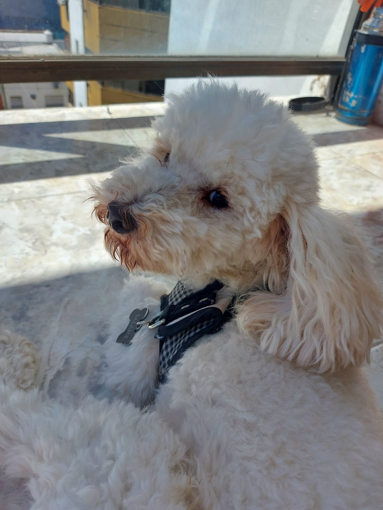
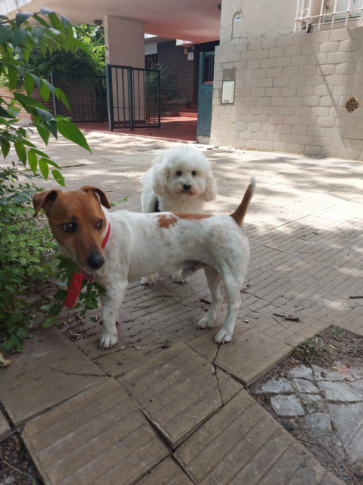
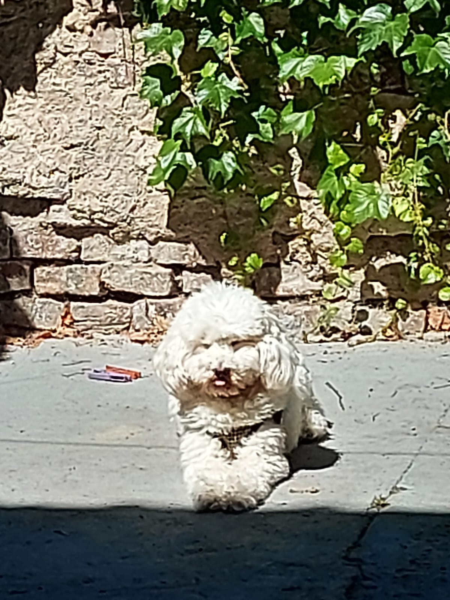

# Ariadna Belén Aspitia

## Sobre mí

Soy estudiante de tercer año de la carrera Licenciatura en Informática en la Universidad Nacional de La Plata (UNLP). Actualmente participo en el proyecto de extensión Ciencia de Datos en Escuelas del LINTI. **Fun fact:** tengo un perro caniche llamado [Salame](https://d2r9epyceweg5n.cloudfront.net/stores/001/170/541/products/2-grueso1-1d0373df8a01d9bda516172362452206-480-0.jpg).

Adjunto fotos del susodicho:

Posando para la cámara

Con su amigo Pirulo

Tomando sol...

Por sí esas fotos no fueron suficientes, también tiene [instagram](https://www.instagram.com/salamelp/)!!!

